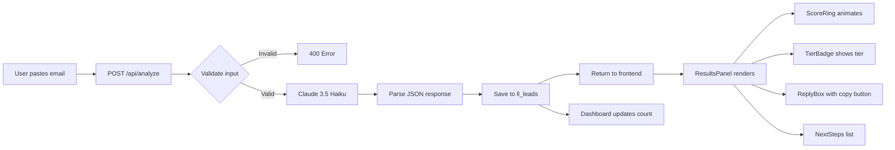

# LeadLens — AI Sales Intelligence Dashboard

> **Built by [Abrar Tajwar Khan](https://www.fiverr.com) — available for custom AI development on Fiverr.**

[](https://leadlens-ai.vercel.app)
[](https://github.com/WarRinOP/leadlens-ai)
[](https://nextjs.org)
[](https://anthropic.com)

---

LeadLens is a production-grade AI sales intelligence dashboard that analyzes inbound lead emails and returns a quality score, intent signals, a personalized draft reply, and actionable next steps — all powered by Claude 3.5 Haiku.

## Features

| Feature | Description |
|---|---|
| 🎯 **Lead Scoring** | Every email gets a 0–100 quality score with Hot / Warm / Cold tier classification |
| ⚡ **Signal Analysis** | Intent, urgency, and budget signal extraction from unstructured email text |
| ✉️ **Draft Reply** | Fully personalized response drafted by Claude, ready to copy and send |
| 📋 **Next Steps** | 4 specific, actionable follow-up steps ranked by priority |
| 📊 **Pipeline Dashboard** | Filter, search, and manage all analyzed leads in one place with CSV export |

## Screenshots

> *(Add screenshots after Vercel deploy)*
> - Analyzer page with sample lead filled
> - ResultsPanel showing Hot lead with score ring animated
> - Dashboard with filter bar and lead table
> - Lead drawer open with full details

## Tech Stack

| Technology | Version | Purpose |
|---|---|---|
| **Next.js** | 16.1.6 (App Router + Turbopack) | Full-stack React framework |
| **Supabase** | Latest | PostgreSQL database + client SDK |
| **Claude (Haiku 4.5)** | claude-haiku-4-5-20251001 | Lead analysis AI |
| **Tailwind CSS** | v4 (CSS-first config) | Styling and design system |
| **TypeScript** | 5.x | Type safety throughout |
| **Vercel** | — | Hosting and deployment |

## Architecture



## Database Schema

### `ll_leads`
| Column | Type | Description |
|---|---|---|
| `id` | uuid | Primary key |
| `business_type` | text | Analyzer business type selection |
| `brand_name` | text | User's brand/company name |
| `email_content` | text | Raw inbound lead email |
| `score` | integer | 0–100 quality score from Claude |
| `tier` | text | Hot / Warm / Cold |
| `reason` | text | Claude's reasoning for the score |
| `intent` | text | High / Medium / Low |
| `urgency` | text | High / Medium / Low |
| `budget_signal` | text | Strong / Moderate / Weak / None |
| `drafted_reply` | text | Personalized reply from Claude |
| `next_steps` | text[] | Array of 4 action items |
| `created_at` | timestamptz | Auto-set on insert |

### `ll_settings`
| Column | Type | Description |
|---|---|---|
| `id` | uuid | Fixed UUID (single-row settings) |
| `default_business_type` | text | Persisted form preference |
| `default_brand_name` | text | Persisted form preference |
| `updated_at` | timestamptz | Auto-set on update |

## Environment Variables

| Variable | Required | Description |
|---|---|---|
| `NEXT_PUBLIC_SUPABASE_URL` | ✅ | Your Supabase project URL |
| `NEXT_PUBLIC_SUPABASE_ANON_KEY` | ✅ | Supabase anon/public key |
| `SUPABASE_SERVICE_ROLE_KEY` | ✅ | Supabase service role key (server-only) |
| `ANTHROPIC_API_KEY` | ✅ | Anthropic API key for Claude |

## Local Setup

### 1. Clone the repo

```bash
git clone https://github.com/WarRinOP/leadlens-ai.git
cd leadlens-ai
```

### 2. Install dependencies

```bash
npm install
```

### 3. Configure environment variables

```bash
cp .env.local.example .env.local
```

Edit `.env.local` with your Supabase and Anthropic credentials.

### 4. Create Supabase tables

Run the following SQL in your Supabase SQL editor:

```sql
-- Leads table
CREATE TABLE ll_leads (
  id              uuid PRIMARY KEY DEFAULT gen_random_uuid(),
  business_type   text NOT NULL,
  brand_name      text NOT NULL,
  email_content   text NOT NULL,
  score           integer NOT NULL CHECK (score BETWEEN 0 AND 100),
  tier            text NOT NULL CHECK (tier IN ('Hot','Warm','Cold')),
  reason          text,
  intent          text,
  urgency         text,
  budget_signal   text,
  drafted_reply   text,
  next_steps      text[],
  created_at      timestamptz DEFAULT now()
);

CREATE INDEX idx_ll_leads_tier       ON ll_leads(tier);
CREATE INDEX idx_ll_leads_created_at ON ll_leads(created_at DESC);

-- Settings table (single row)
CREATE TABLE ll_settings (
  id                    uuid PRIMARY KEY DEFAULT '00000000-0000-0000-0000-000000000001',
  default_business_type text DEFAULT 'Marketing Agency',
  default_brand_name    text DEFAULT '',
  updated_at            timestamptz DEFAULT now()
);

INSERT INTO ll_settings (id) VALUES ('00000000-0000-0000-0000-000000000001')
ON CONFLICT (id) DO NOTHING;
```

### 5. Run the dev server

```bash
npm run dev
```

Open [http://localhost:3000](http://localhost:3000) in your browser.

## Deployment (Vercel)

1. Connect `github.com/WarRinOP/leadlens-ai` to a new Vercel project
2. Add all 4 environment variables in the Vercel project settings
3. Deploy — Vercel will auto-detect Next.js and build correctly

## API Routes

| Route | Method | Description |
|---|---|---|
| `/api/analyze` | POST | Run Claude analysis on a lead email |
| `/api/leads` | GET | Fetch all leads with optional filters |
| `/api/leads` | DELETE | Delete a lead by ID |
| `/api/settings` | GET | Fetch saved form defaults |
| `/api/settings` | PUT | Update saved form defaults |
| `/api/export` | GET | Download leads as CSV |

---

> **Portfolio project by Abrar Tajwar Khan.**
> Available for custom AI agent development, dashboard builds, and Supabase integrations on Fiverr.
